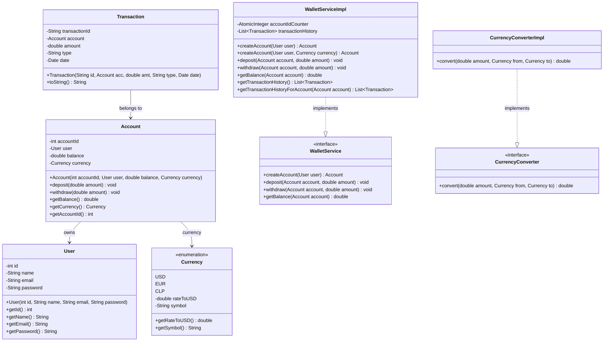

# 🚀 Alke Wallet - Billetera Digital

Alke Wallet es una aplicación de consola en **Java** diseñada para la empresa fintech **Alkemy Digital**. El objetivo principal de este sistema es ofrecer a los usuarios una solución segura y fácil de usar para administrar sus activos financieros de manera digital, permitiendo realizar transacciones como depósitos, retiros y conversión de divisas de manera confiable.

El proyecto está diseñado bajo principios de **Programación Orientada a Objetos (POO)**, aplicando las mejores prácticas de desarrollo de software (principios SOLID, Clean Code) y utilizando **Interfaces** y **Pruebas Unitarias** con **JUnit 5**.

---

## 📋 Características y Casos de Uso
1. **Registro de Usuarios y Creación de Cuentas**: Creación de cuentas de usuario asignadas a una billetera en una divisa específica (CLP, USD o EUR).
2. **Visualización de Saldo**: Consulta del saldo disponible en tiempo real con símbolos correspondientes.
3. **Ingreso y Retiro de Dinero**: Depósitos y retiros seguros que validan que los montos sean positivos y que existan fondos suficientes.
4. **Conversión de Moneda**: Permite cotizar o convertir cualquier monto entre las monedas soportadas (`CLP`, `USD`, `EUR`) utilizando factores de conversión dinámicos y exactos.
5. **Historial de Transacciones**: Registro ordenado y detallado de cada movimiento realizado en la billetera.
6. **Robustez y Control de Errores**: Manejo de excepciones personalizadas para operaciones prohibidas (como retirar más dinero del disponible o ingresar montos negativos).

---

## 🛠️ Estructura del Proyecto

El código fuente está estructurado de forma modular en las siguientes capas de arquitectura:

* **`com.alkemy.wallet`**: Contiene la clase de entrada principal `Main.java` que ejecuta el menú interactivo.
* **`com.alkemy.wallet.model`**: Contiene las entidades esenciales del dominio:
  * `User.java` - Datos de usuario (ID, nombre, correo, contraseña).
  * `Account.java` - Billetera/cuenta asociada a un usuario, su saldo y tipo de moneda.
  * `Currency.java` - Enum para modelar `USD`, `EUR`, `CLP` con sus respectivos tipos de cambio y símbolos.
  * `Transaction.java` - Registro individual de operaciones.
* **`com.alkemy.wallet.exception`**: Excepciones personalizadas del sistema:
  * `InsufficientFundsException.java` - Lanzada al intentar un retiro mayor al saldo disponible.
* **`com.alkemy.wallet.service.interfaces`**: Interfaces que definen los contratos para los servicios del negocio:
  * `WalletService.java` - Firmas de métodos de depósitos, retiros y saldo.
  * `CurrencyConverter.java` - Firma de método para conversión monetaria.
* **`com.alkemy.wallet.service.impl`**: Implementación concreta de la lógica del negocio:
  * `WalletServiceImpl.java` - Lógica transaccional de depósitos, retiros y registro del historial.
  * `CurrencyConverterImpl.java` - Lógica de cotización matemática entre divisas.
* **`src/test/java/com/alkemy/wallet/service`**: Suite de pruebas automáticas escritas en JUnit 5:
  * `WalletServiceTest.java`
  * `CurrencyConverterTest.java`

---

## 🏗️ Diagrama de Clases (Mermaid)

El siguiente diagrama modela la estructura de clases del proyecto:



---

## ⚙️ Requisitos Previos

Para compilar, probar y ejecutar esta aplicación, necesitarás instalar en tu entorno local:
1. **Java Development Kit (JDK) 17 o superior**.
2. **Apache Maven 3.6 o superior**.

---

## 🚀 Compilación y Ejecución

### 1. Compilación del proyecto
Para compilar el proyecto y descargar todas las dependencias necesarias de JUnit 5, navega al directorio del proyecto y ejecuta:
```bash
mvn clean compile
```

### 2. Ejecutar la demo funcional (Consola)
Para iniciar el menú de consola interactivo de Alke Wallet, puedes utilizar el plugin `exec-maven-plugin` incluido en el `pom.xml`:
```bash
mvn exec:java
```
O también puedes compilar un archivo `.jar` y ejecutarlo directamente:
```bash
mvn clean package
java -cp target/alke-wallet-1.0-SNAPSHOT.jar com.alkemy.wallet.Main
```

---

## 🧪 Pruebas Unitarias

El proyecto incluye pruebas robustas con **JUnit 5** que validan el comportamiento ante flujos correctos y errores del sistema.

Para ejecutar todas las pruebas unitarias:
```bash
mvn test
```

### Casos de Prueba Cubiertos
* **WalletServiceTest.java**:
  * Creación exitosa de cuentas por defecto y con divisas personalizadas.
  * Depósitos exitosos y actualización correcta de saldos.
  * Validación ante depósitos negativos o de valor cero (excepciones controladas).
  * Retiros exitosos y descuento en saldo.
  * Generación y control de la excepción `InsufficientFundsException` cuando el monto de retiro supera el saldo disponible.
  * Validación ante retiros con valores inválidos (negativos o cero).
* **CurrencyConverterTest.java**:
  * Conversiones monetarias exactas entre `CLP` y `USD` (en ambas direcciones).
  * Conversiones monetarias exactas entre `USD` y `EUR` (en ambas direcciones).
  * Conversiones monetarias exactas entre `EUR` y `CLP` (en ambas direcciones).
  * Conversión de monedas idénticas (retorna el mismo valor original).
  * Excepciones ante intentos de conversión con valores negativos o parámetros nulos.
